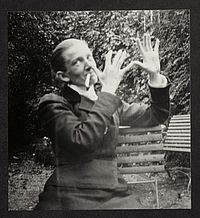
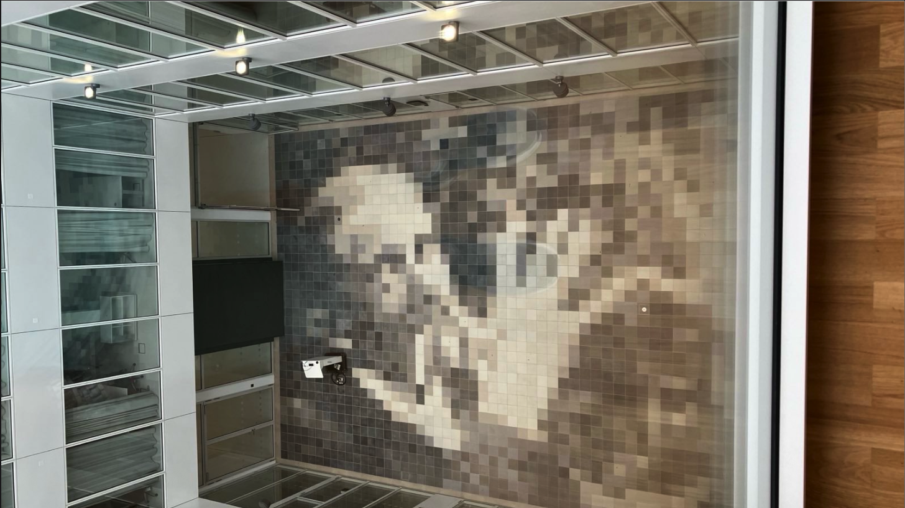
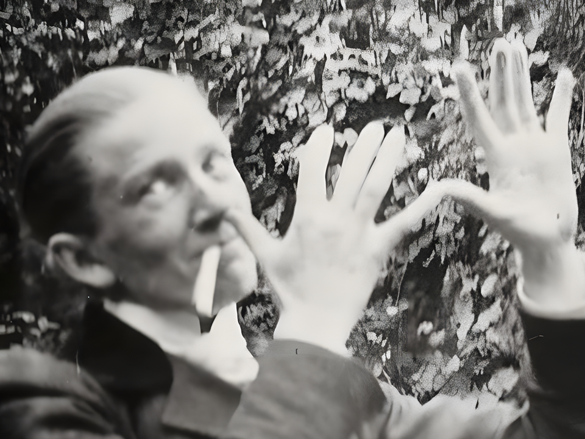
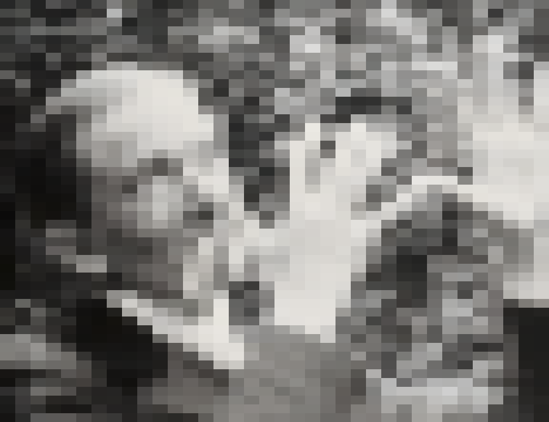
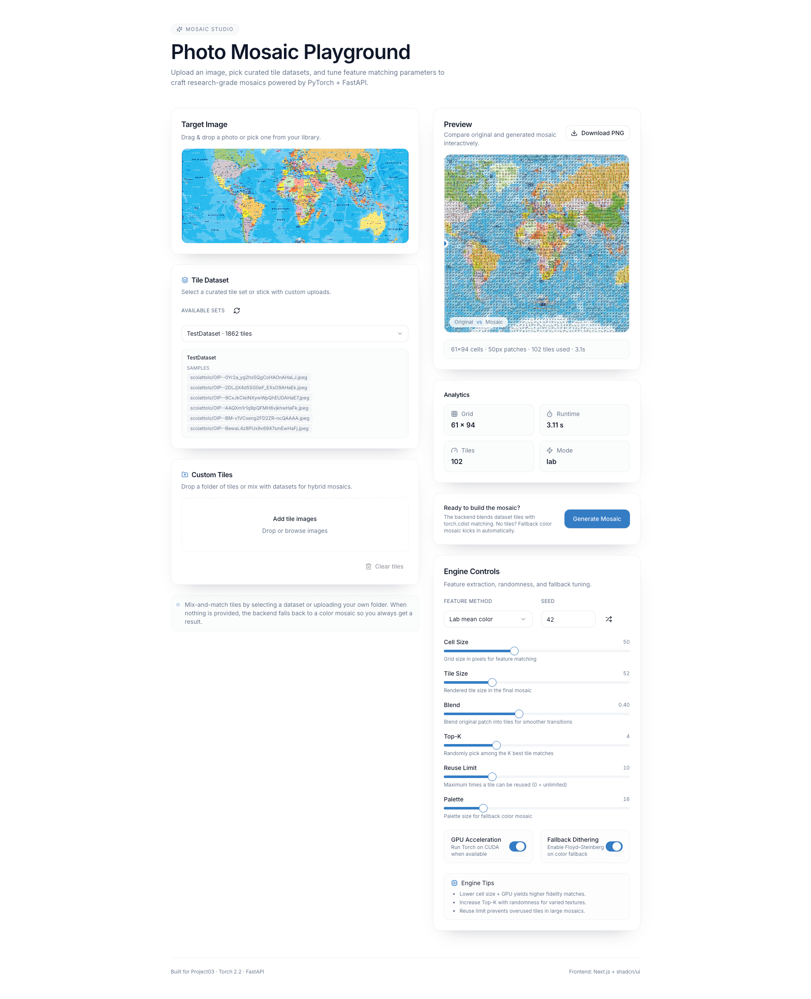
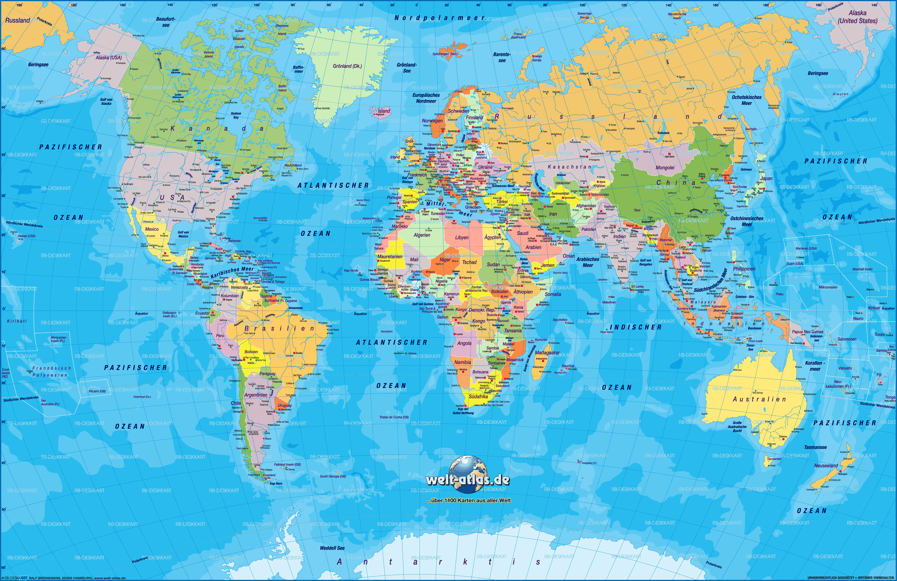
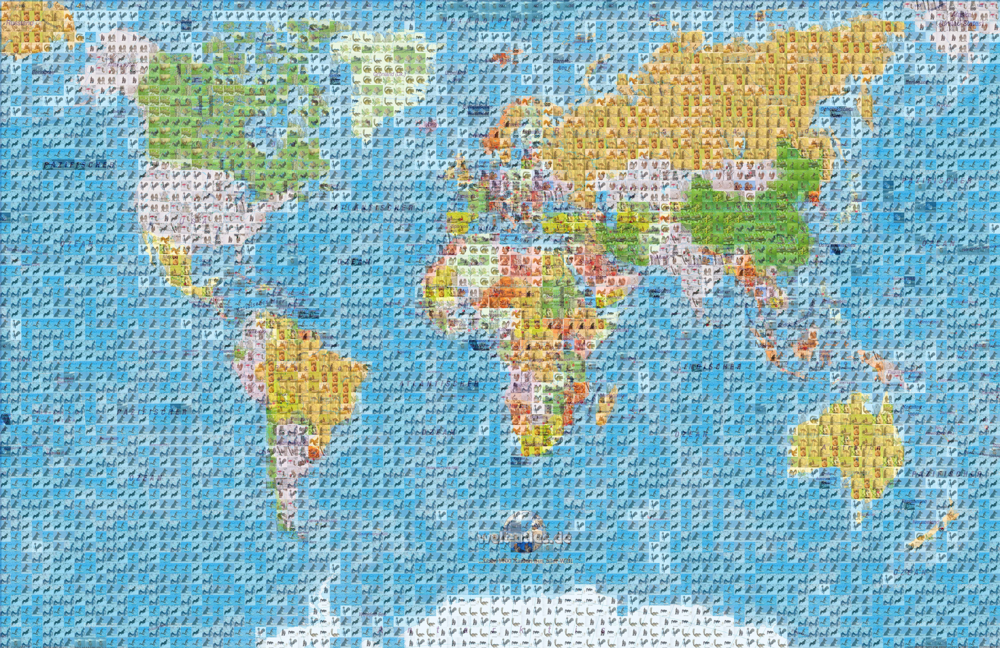

# Bildverarbeitung Exercises – Master Semester 1

## 🧩 Overview

A collection of three projects exploring digital image processing concepts—from linear filtering and grayscale conversion to palette-based mosaics and interactive photo mosaic generation.

### Projects

1. **Color2Gray** – convert color images to grayscale via convolutional filtering.
2. **Maria-von-Linden** – recreate the famous tiled wall using PyTorch and palette quantisation.
3. **Creating Mosaics** – full-stack photo mosaic studio (FastAPI + Torch backend, Next.js frontend).

---

## 🎨 Project 1 – Color2Gray

- RGB images use **three channels**; grayscale uses **one**.
- Implemented a lightweight **PyTorch** script using `torch.nn.Conv2d` to transform 3-channel RGB into a single-channel grayscale image using **BT.601 weights** `(0.299, 0.587, 0.114)`.
- CLI usage:

  ```bash
  python convert.py input.png output.png
  ```

- Source lives in `Project01/`, with automated tests under `tests/`.

---

## 🧱 Project 2 – Maria-von-Linden

Investigate and digitally recreate the tiled portrait housed in _Maria-von-Linden-Straße 1_.

- The wall contains **48 × 36 = 1 728 tiles** (20×20 px each for a 960×720 reference).
- Pipeline:
  1. Split the portrait into square tiles.
  2. Compute the **average color per tile** (box filter via `Conv2d`).
  3. Replace each region with its average and upscale using nearest-neighbour.
- Added **palette quantisation** (k-means in Lab space) and flexible **crop/pad policies** to mimic real mosaics.

Result snapshots:






---

## 🖼️ Project 3 – Photo Mosaics

Interactive application that builds photo mosaics from datasets of tiles or fallback palette quantisation.



### Backend (FastAPI + Torch 2.2)

- Exposes `/generate` and `/datasets` endpoints.
- Computes Lab/HSV/Sobel/Hybrid features, supports GPU acceleration, top-K sampling, reuse limits, and palette fallback.

### Frontend (Next.js + shadcn/ui)

- Drag & drop target uploader, custom tile folder ingestion, dataset selector.
- Live split-view preview with metadata analytics and downloadable results.
- Extensive control panel for blend, palette size, feature method, dithering, and randomness.

### Conceptual Discussion

- Mosaic generation resembles **non-linear filtering**: features are computed via convolution-like operations, but tile replacement is a discrete nearest-neighbour decision.
- Feature options include mean Lab, HSV histograms, Sobel energy, perceptual embeddings, and hybrid combinations—each impacting colour harmony, texture fidelity, and semantic alignment.
- Core computations:
  - Extract descriptors for each target patch and tile.
  - Compute similarity distances (ΔE, χ², cosine, etc.).
  - Select best tile per patch; record usage statistics and runtime.

Example transformation:

Input:



Output mosaic:



---

## 📂 Repository Structure

```
Exercise01/
├── Project01/      # Color2Gray conversion toolkit
├── Project02/      # Maria-von-Linden mosaic recreation
├── Project03/      # Mosaic Studio backend & frontend
└── Docs/           # Shared documentation assets
```

Enjoy exploring the projects, and feel free to mix datasets or extend the pipelines to create your own mosaics! :sparkles:
